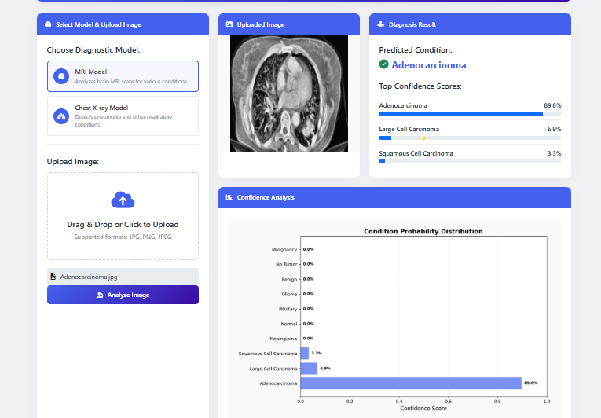
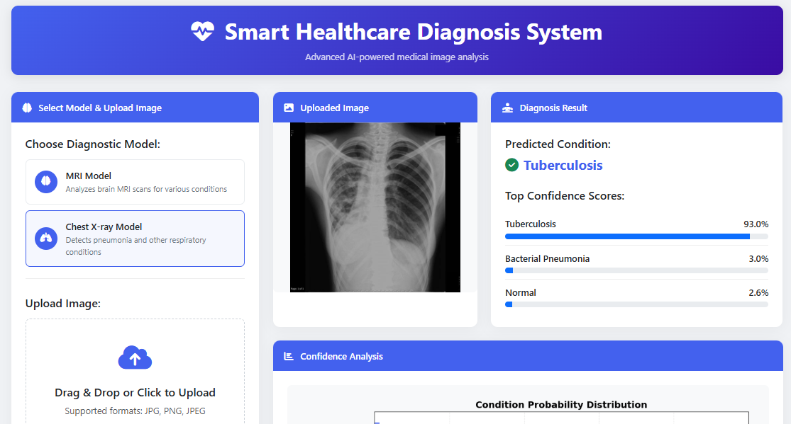

# Smart Healthcare Diagnosis System :hospital:

A comprehensive web-based system for disease prediction using X-ray and MRI scans

 



## 🚀 Quick Start Guide

### 1. Clone the repo

```bash
git clone https://github.com/zentronixsolutions/Smart-Healthcare-Diagnosis-System.git
```

```bash
cd Smart-Healthcare-Diagnosis-System
```

```bash
python3 -m venv venv

source venv/bin/activate       # macOS/Linux

venv\Scripts\activate          # Windows

```

```bash
pip install -r requirements.txt
```